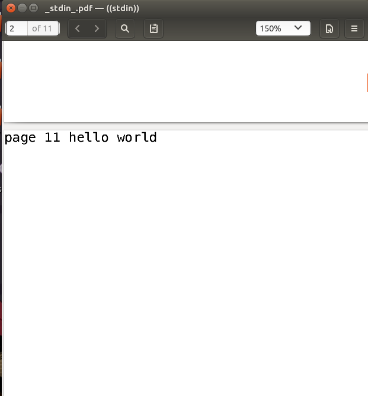
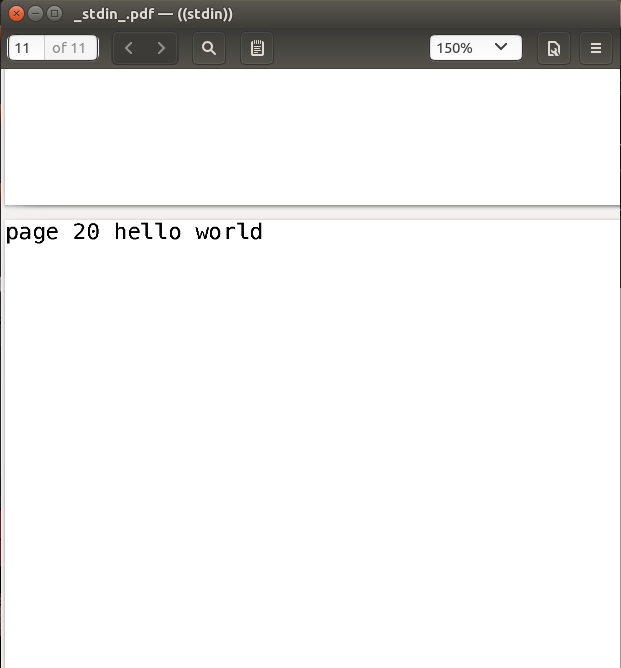
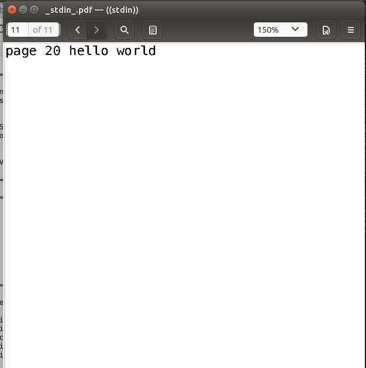

# CLI 命令行实用程序开发基础 #

* 本次作业根据进行[开发 Linux 命令行实用程序](https://www.ibm.com/developerworks/cn/linux/shell/clutil/index.html)开发

* 测试工具

    + ubuntu下安装模拟打印机cups-pdf，供测试"lp"指令：

        [PDF printer for CUPS](https://apps.ubuntu.com/cat/applications/lucid/cups-pdf/)

    + 由[gen_data.go](data/gen_data.go)生成的供测试两种换页类型的输入文件：

        - [l_input_file](data/l_input_file)：由1000个"line i hello world\n"(1<=i<=1000)语句组成
        
        - [f_input_file](data/f_input_file)：由1000个"page i hello world\f"(1<=i<=1000)语句组成

        - [gen_data.go](data/gen_data.go)用法：
            
            ```
            $ go build gen_data.go
            $ ./gen_data
            ```

* 命令行输入

    + 编译

        ```
        $ go build selpg.go
        $ ./selpg
        ```

    + 用法说明

        > -d string
        >
        > print_dest: name of printer
        >
        > -e int
        >
        > end printing after page "end_page" (default -1)
        > -f	
        >
        > page_type: if paper feed or not (default false)
        > 
        > -l int
        >
        > page_len: numbers of lines written on a piece of pa (default 72)
        >
        > -s int
        >
        > begin printing from page "start_page" (default -1)

    + 运行效果示例

        - 测试按行数换页打印

            ```
            $ ./selpg -s 10 -e 20 -l 20 -d PDF data/l_input_file
            ```
            可以在[PDF printer for CUPS](https://apps.ubuntu.com/cat/applications/lucid/cups-pdf/)生成文件的文件夹下看到打印出来的pdf文件，效果如下图：

            

            

            

            输入命令要求打印格式：每页20行，从第10页（即第181行）开始到第20页完成（即第400页），从打印效果可以看到，打印了第181-400行，打印结果正确

        - 测试走纸换页换页打印
            ```        
            $ ./selpg -s 10 -e 20 -f -d PDF data/f_input_file
            ```

            打印出来的pdf文件总共11页，效果如下图：

            

            

            

            输入命令要求打印格式：走纸换页类型，从第10页开始到第20页完成，从打印效果可以看到，打印了11页，每页一句“page i hello world\f”(10<=i<=20)，打印结果正确

        - 测试"打印机名称错误"

          

* PS:先前写过一个[“亲自解析命令行的版本”](pre_code/t.go)，发现会扣分于是连夜重写了用flag解析的版本XD

    + 需要的测试工具同上
    
    + 用法
        - 编译，进入pre_code目录下
            ```
            $ go build t.go
            ```
        
        - 运行：运行命令与[selpc.c](https://www.ibm.com/developerworks/cn/linux/shell/clutil/selpg.c)完全一样
            ```
            USAGE: s -sstart_page -eend_page [ -f | -llines_per_page ] [ -ddest ] [ in_filename ]
            ```
        - 简单的运行示例

            * 测试按行数换页打印

            ```
            ./t -s10 -e20 -l10 -dPDF ../data/l_input_file
            ```
            打印效果：

            

            

            * 测试走纸换页打印

            ```
            ./t -s10 -e20 -f -dPDF ../data/f_input_file

            ```
            打印效果：

            
            
            