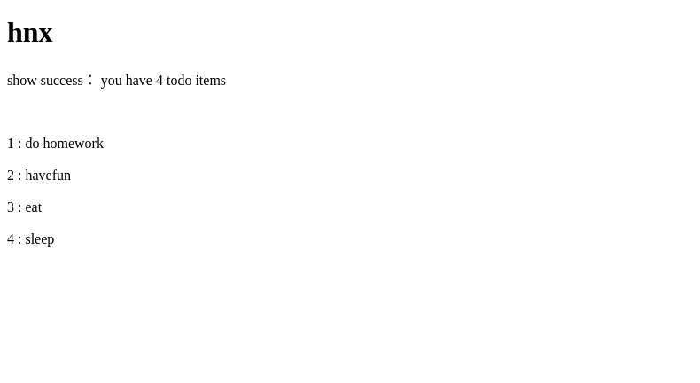
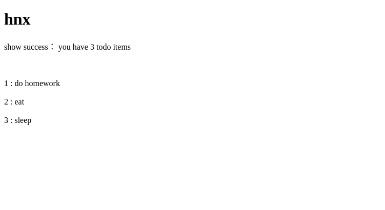

# 开发 web 服务程序

## Task requirements

1. 熟悉 go 服务器工作原理

2. 基于现有 web 库，编写一个简单 web 应用类似 cloudgo

3. 使用 curl 工具访问 web 程序

4. 对 web 执行压力测试

The task requirements is from [ex-cloudgo-start](doc/ex-cloudgo-start.html)

## About Todos

This program easy to use can help people to record what they need to do in a simple way. Users just type URL into their browser or enter command at the command line. There are only four command for using totally. The data of users are saved in database stored on the server so users should be online when using this tools. User should register by username and password. User can add, delete and show the todolist with username and password.

## Install
Before running this program, please make sure that you have installed the following tools.

+ golang

+ MySQL

    [Install MySQL on ubuntu](https://www.digitalocean.com/community/tutorials/how-to-install-mysql-on-ubuntu-14-04)

+ a database driver

    [mysql](https://github.com/go-sql-driver/mysql) is a database driver of the program. 

    > $ go get github.com/go-sql-driver/mysql

## Usage

+ Get the program

    > $ go get github.com/freakkid/Service-Computing/hw3

+ Reset some paraments

    To work on your computer, the code of the program should be reset according to the conditions of your computer. 
    
    You should reset the **username**, **password**, **addrs**, **port** on the [server_data.go](). The **username**, **password** are the username and password of your mysql databases and **addrs**, **port** are the ip address and port of tcp connection to your databases.

+ Install again after reseting
    
    > $ go install github.com/freakkid/Service-Computing/hw3
    
    Had better make sure that have added GOPATH in PATH.

    The default port is 8080:

    > $ hw3

    ```
    2017/11/08 20:58:25 [Todos]  port 8080 is listening
    
    ...
    ```

    Or the port can be seted by:

    > $ hw3 -p 9090

    ```
    2017/11/08 20:58:25 [Todos]  port 9090 is listening
    
     ...
    ```

    End the program by _Ctrl + C_

+ Register as a user

    * The register URL format is: user/registe?username=XXX&password=XXX

    * You can type URL into browser:

    >  http://localhost:8080/user/register?username=hnx&password=hnx

    

    Or you can enter on the command line:

    > $ curl -v  http://localhost:8080/user/register?username=hnx\&password=hnx

    ```    
    *   Trying 127.0.0.1...
    * Connected to localhost (127.0.0.1) port 8080 (#0)
    > GET /user/register?username=hnx&password=hnx HTTP/1.1
    > Host: localhost:8080
    > User-Agent: curl/7.47.0
    > Accept: */*
    > 
    < HTTP/1.1 200 OK
    < Date: Wed, 08 Nov 2017 13:17:44 GMT
    < Content-Length: 134
    < Content-Type: text/html; charset=utf-8
    < 
    <!DOCTYPE html>
    <html>

    <head>
        <title>Todos</title>
    </head>

    <body>
        <h1>hnx</h1>

        <p>register success</p>
    </body>

    * Connection #0 to host localhost left intact

    ```

    * If you type empty username or password, you will receive a error message:

    > $ curl -v  httalhost:8080/user/register?username=\&password=hnx

    ```
    *   Trying 127.0.0.1...
    * Connected to localhost (127.0.0.1) port 8080 (#0)
    > GET /user/register?username=&password=hnx HTTP/1.1
    > Host: localhost:8080
    > User-Agent: curl/7.47.0
    > Accept: */*
    > 
    < HTTP/1.1 200 OK
    < Date: Wed, 08 Nov 2017 13:22:34 GMT
    < Content-Length: 156
    < Content-Type: text/html; charset=utf-8
    < 
    <!DOCTYPE html>
    <html>

    <head>
        <title>Todos</title>
    </head>

    <body>
        <h1></h1>

        <p>username and password should be non-empty</p>
    </body>

    * Connection #0 to host localhost left intact
    </html>
    ```

    * If you register twice with the same username, you will receive errors:

    > $ curl -v  http://localhost:8080/user/register?username=hnx\&password=hnx

    ```
    *   Trying 127.0.0.1...
    * Connected to localhost (127.0.0.1) port 8080 (#0)
    > GET /user/register?username=hnx&password=hnx HTTP/1.1
    > Host: localhost:8080
    > User-Agent: curl/7.47.0
    > Accept: */*
    > 
    < HTTP/1.1 200 OK
    < Date: Wed, 08 Nov 2017 13:22:12 GMT
    < Content-Length: 164
    < Content-Type: text/html; charset=utf-8
    < 
    <!DOCTYPE html>
    <html>

    <head>
        <title>Todos</title>
    </head>

    <body>
        <h1>hnx</h1>

        <p>register fail: the username may have been used</p>
    </body>

    * Connection #0 to host localhost left intact
    </html>
    ```

    * Or, if you type invalid URL, you may get a 404 page:

    > $ curl -v  httalhost:8080/user/regis

    ```    
    *   Trying 127.0.0.1...
    * Connected to localhost (127.0.0.1) port 8080 (#0)
    > GET /user/regis HTTP/1.1
    > Host: localhost:8080
    > User-Agent: curl/7.47.0
    > Accept: */*
    > 
    < HTTP/1.1 404 Not Found
    < Content-Type: text/plain; charset=utf-8
    < X-Content-Type-Options: nosniff
    < Date: Wed, 08 Nov 2017 13:27:58 GMT
    < Content-Length: 19
    < 
    404 page not found
    * Connection #0 to host localhost left intact
    ```

+ Add todo item

    * The add URL format is: todo/add?username=XXX&password=XXX&item=XXX

    * You can type URL into browser:

        >  http://localhost:8080/todo/add?username=hnx&password=hnx&item=do home work

        

        Or you can enter on the command line:

        > $ curl -v  http://localhost:8080/todo/add?username=hnx\&password=hnx\&item=havefun

        ```
        *   Trying 127.0.0.1...
        * Connected to localhost (127.0.0.1) port 8080 (#0)
        > GET /todo/add?username=hnx&password=hnx&item=havefun HTTP/1.1
        > Host: localhost:8080
        > User-Agent: curl/7.47.0
        > Accept: */*
        > 
        < HTTP/1.1 200 OK
        < Date: Wed, 08 Nov 2017 13:44:35 GMT
        < Content-Length: 129
        < Content-Type: text/html; charset=utf-8
        < 
        <!DOCTYPE html>
        <html>

        <head>
            <title>Todos</title>
        </head>

        <body>
            <h1>hnx</h1>

            <p>add success</p>
        </body>

        * Connection #0 to host localhost left intact
        </html>
        ```
    
    * If you type empty item:
        
        > $ curl -v  http://localhost:8080/todo/add?username=hnx\&password=hnx\&item=

        ```
        *   Trying 127.0.0.1...
        * Connected to localhost (127.0.0.1) port 8080 (#0)
        > GET /todo/add?username=hnx&password=hnx&item= HTTP/1.1
        > Host: localhost:8080
        > User-Agent: curl/7.47.0
        > Accept: */*
        > 
        < HTTP/1.1 200 OK
        < Date: Wed, 08 Nov 2017 13:45:49 GMT
        < Content-Length: 195
        < Content-Type: text/html; charset=utf-8
        < 
        <!DOCTYPE html>
        <html>

        <head>
            <title>Todos</title>
        </head>

        <body>
            <h1>hnx</h1>

            <p>add fail: please check username and password and the item should be non-empty</p>
        </body>

        * Connection #0 to host localhost left intact
        </html>
        ```

+ Show all todo items
    
    * The show URL format is: todo/show?username=XXX&password=XXX

    * You can type URL into browser:

    >  http://localhost:8080/todo/show?username=hnx&password=hnx

    

    Or you can enter on the command line:

    > $ curl -v  http://localhost:8080/todo/show?username=hnx\&password=hnx

    ```
    *   Trying 127.0.0.1...
    * Connected to localhost (127.0.0.1) port 8080 (#0)
    > GET /todo/show?username=hnx&password=hnx HTTP/1.1
    > Host: localhost:8080
    > User-Agent: curl/7.47.0
    > Accept: */*
    > 
    < HTTP/1.1 200 OK
    < Date: Wed, 08 Nov 2017 13:48:52 GMT
    < Content-Length: 320
    < Content-Type: text/html; charset=utf-8
    < 
    <!DOCTYPE html>
    <html>

    <head>
        <title>Todos</title>
    </head>

    <body>
        <h1>hnx</h1>

        <p>show success： you have 4 todo items</p>

        <div>
            <br /><br />   1 : do homework  <br /><br />   2 : havefun  <br /><br />   3 : eat  <br /><br />   4 : sleep  <br /><br /> 
        </div>
    </body>

    * Connection #0 to host localhost left intact
    </html>
    ```

+ Delete todo item
    
    * The delete URL format is: todo/delete?username=XXX&password=XXX&itemIndex=XXX

    * You can type URL into browser to delete the second item:

    >  http://localhost:8080/todo/delete?username=hnx&password=hnx&itemIndex=2

    

    And show todolist after deleting:

    

    Or you can enter on the command line:

    > $ curl -v  http://localhost:8080/todo/delete?username=hnx\&password=hnx\&itemIndex=3

    ```
    *   Trying 127.0.0.1...
    * Connected to localhost (127.0.0.1) port 8080 (#0)
    > GET /todo/delete?username=hnx&password=hnx&itemIndex=3 HTTP/1.1
    > Host: localhost:8080
    > User-Agent: curl/7.47.0
    > Accept: */*
    > 
    < HTTP/1.1 200 OK
    < Date: Wed, 08 Nov 2017 13:54:48 GMT
    < Content-Length: 132
    < Content-Type: text/html; charset=utf-8
    < 
    <!DOCTYPE html>
    <html>

    <head>
        <title>Todos</title>
    </head>

    <body>
        <h1>hnx</h1>

        <p>delete success</p>
    </body>

    * Connection #0 to host localhost left intact
    </html>
    ```
    And show all items:

    > $ curl -v  httalhost:8080/todo/show?username=hnx\&password=hnx

    ```
    *   Trying 127.0.0.1...
    * Connected to localhost (127.0.0.1) port 8080 (#0)
    > GET /todo/show?username=hnx&password=hnx HTTP/1.1
    > Host: localhost:8080
    > User-Agent: curl/7.47.0
    > Accept: */*
    > 
    < HTTP/1.1 200 OK
    < Date: Wed, 08 Nov 2017 14:18:41 GMT
    < Content-Length: 257
    < Content-Type: text/html; charset=utf-8
    < 
    <!DOCTYPE html>
    <html>

    <head>
        <title>Todos</title>
    </head>

    <body>
        <h1>hnx</h1>

        <p>show success： you have 2 todo items</p>

        <div>
            <br /><br />   1 : do homework  <br /><br />   2 : eat  <br /><br /> 
        </div>
    </body>

    * Connection #0 to host localhost left intact
    </html>
    ```

    If you type invalid itemIndex such as non-numeric string, less than one or larger than todolist size, you may get error tips:

    > $ curl -v  httalhost:8080/todo/delete?username=hnx\&password=hnx\&itemIndex=0
    
    ```
    *   Trying 127.0.0.1...
    * Connected to localhost (127.0.0.1) port 8080 (#0)
    > GET /todo/delete?username=hnx&password=hnx&itemIndex=0 HTTP/1.1
    > Host: localhost:8080
    > User-Agent: curl/7.47.0
    > Accept: */*
    > 
    < HTTP/1.1 200 OK
    < Date: Wed, 08 Nov 2017 14:03:30 GMT
    < Content-Length: 200
    < Content-Type: text/html; charset=utf-8
    < 
    <!DOCTYPE html>
    <html>

    <head>
        <title>Todos</title>
    </head>

    <body>
        <h1>hnx</h1>

        <p>delete fail: please check username and password and the item index should be valid</p>
    </body>

    * Connection #0 to host localhost left intact
    </html>
    ```

+ Server will show some information about the requests:

    ```
    2017/11/08 21:12:08 [Todos]  port 8080 is listening
    2017/11/08 21:12:10 [Todos]  GET | 200 | register
    2017/11/08 21:17:44 [Todos]  GET | 200 | register
    2017/11/08 21:22:12 [Todos]  GET | 200 | register
    2017/11/08 21:22:34 [Todos]  GET | 200 | register
    2017/11/08 21:27:58 [Todos]  GET | 400
    2017/11/08 21:32:52 [Todos]  GET | 200 | register
    2017/11/08 21:33:49 [Todos]  GET | 200 | register
    2017/11/08 21:34:08 [Todos]  GET | 200 | add
    2017/11/08 21:34:14 [Todos]  GET | 200 | add
    2017/11/08 21:34:15 [Todos]  GET | 200 | register
    2017/11/08 21:34:24 [Todos]  GET | 200 | register
    2017/11/08 21:42:56 [Todos]  GET | 200 | show
    2017/11/08 21:44:24 [Todos]  GET | 200 | add
    2017/11/08 21:44:35 [Todos]  GET | 200 | add
    2017/11/08 21:45:49 [Todos]  GET | 200 | add
    2017/11/08 21:46:48 [Todos]  GET | 400
    2017/11/08 21:48:40 [Todos]  GET | 200 | show
    2017/11/08 21:48:52 [Todos]  GET | 200 | show
    2017/11/08 21:52:30 [Todos]  GET | 200 | delete
    2017/11/08 21:53:10 [Todos]  GET | 200 | show
    2017/11/08 21:54:48 [Todos]  GET | 200 | delete
    2017/11/08 22:03:16 [Todos]  GET | 200 | show
    2017/11/08 22:03:21 [Todos]  GET | 200 | show
    2017/11/08 22:03:30 [Todos]  GET | 200 | delete
    ...
    ```


## At last, thanks for reviewing!
