# 处理 web 程序的输入与输出(Todos2.0)


## [基本要求](doc/ex-cloudgo-inout.html)
+ 支持静态文件服务
+ 支持简单 js 访问
+ 提交表单，并输出一个表格
+ 对 /unknown 给出开发中的提示，返回码 5xx

## 关于代码(Todos2.0)
+ 本次作业代码是在[上次作业代码](https://github.com/freakkid/Service-Computing/blob/master/hw3)的基础上完成，程序的功能为：用户可用账号密码进行增删查看自己的todolist，功能和用法基本不变，同样使用MySQL作为数据库驱动。

+ 代码获取和配置

> $ go get github.com/freakkid/Service-Computing/hw4

数据库和其他配置参照[Todos1.0](https://github.com/freakkid/Service-Computing/blob/master/hw3/readme.md)，另外还需安装本次作业用到的一些包：

> go get github.com/unrolled/render

> go get github.com/codegangsta/negroni

> go get github.com/gorilla/mux


## 代码测试

## 支持静态文件服务

像浏览器输入 http://localhost:8080/static/ 获取静态文件服务

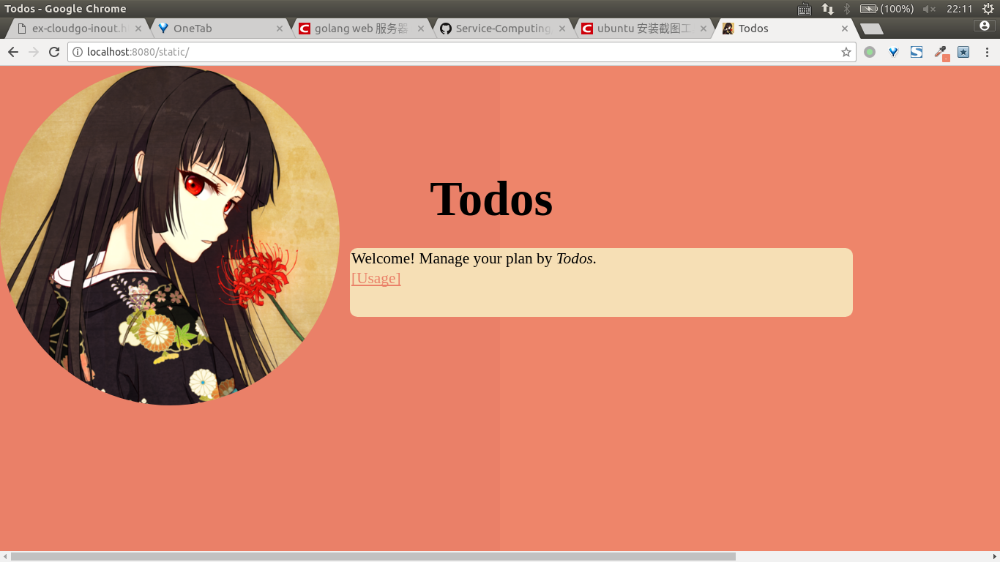

可获取Todos的用法

## 支持简单 js 访问  

+ json返回格式：
```
{
  "Operation": 操作类型,
  "Username": 用户名,
  "Todos": todos列表（只有在show时才非空）,
  "Result": 操作成功与否,
  "Message": 操作结果的详细信息
}
```

+ 进行注册：

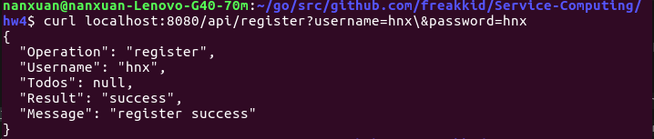

注册的用户名不能重复：

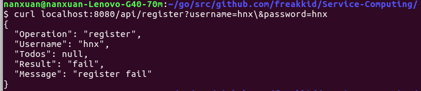

+ 增加todo项

输入的用户名或密码为空

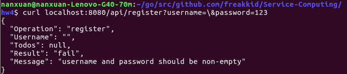

用户名或密码错误

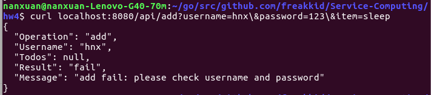

操作成功

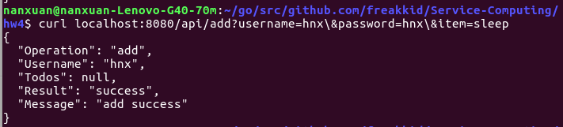

+ 查看所有的todo项

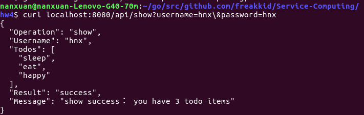

+ 删除todo项

itemIndex是要删除的todos项的序号(大于0，小于todos项总数)，只能为数字

非法itemIndex

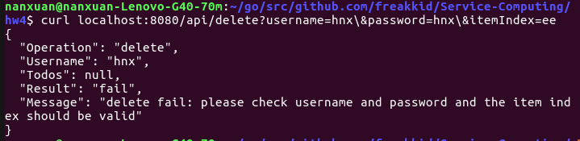

删除成功并查看删除后的效果

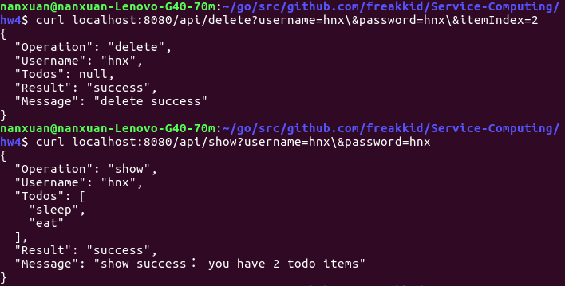

## 提交表单，并输出一个表格

在浏览器输入url获取模板文件，提交表单后获取服务器处理结果。

"/register" "/addItem" "/deleteItem"三个url均是使用ajax来进行异步请求，通过api提交表单，获取服务器返回的信息，并且局部刷新页面，显示出操作结果信息。

"/showItems"是通过html的input标签向服务器post，刷新整个页面来显示操作结果信息。

+ 注册界面

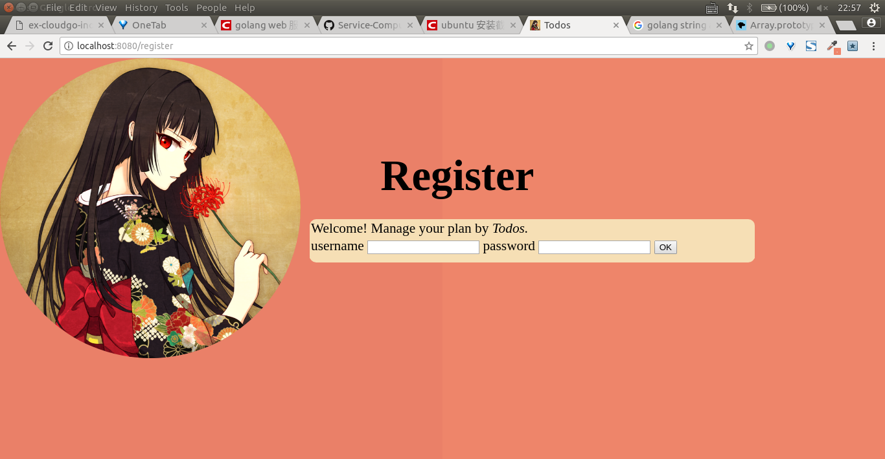

提交表单后得到注册结果

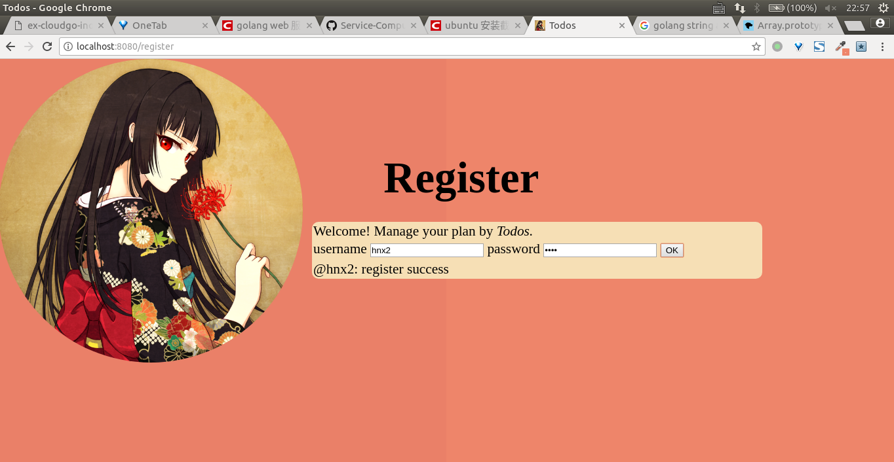

+ 增加todos项

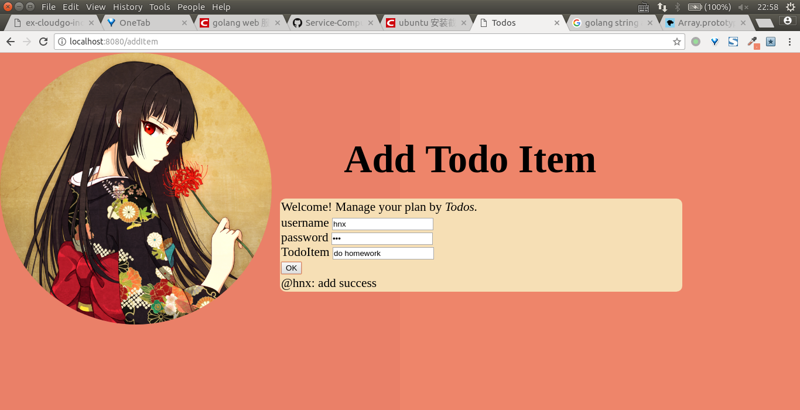

查看所有的todos项

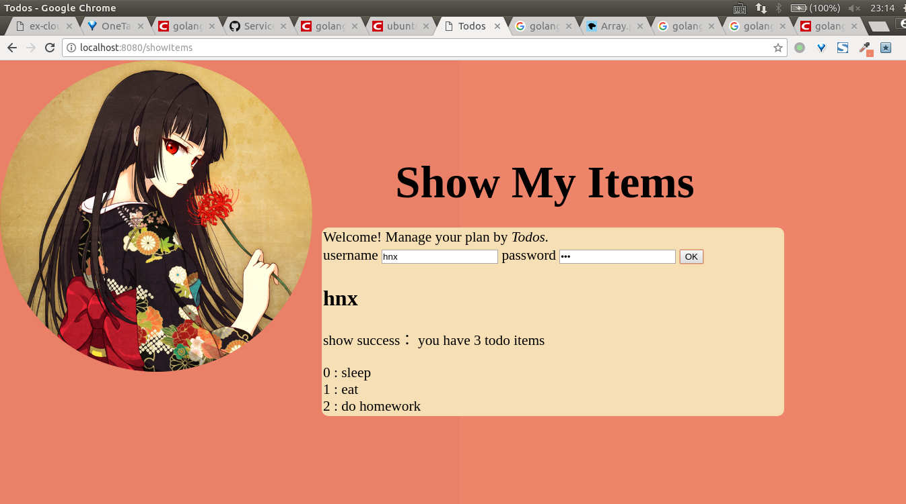

+ 删除todos项

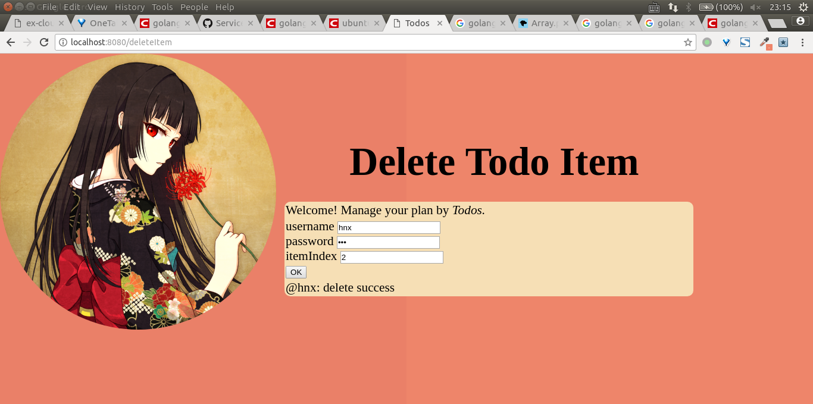

再次查看todos项
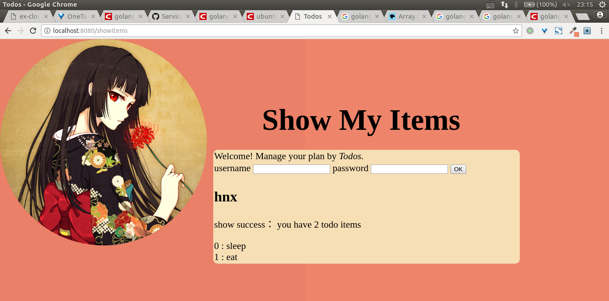


## 对 /unknown 给出开发中的提示，返回码 5xx

在程序中都是以501作为状态码返回

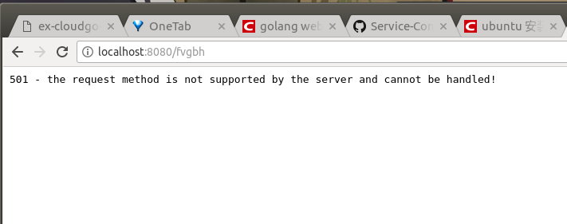

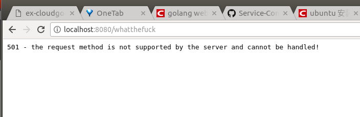

## 其他

+ 数据库的用户ID使用UUID生成，用户密码进行MD5加密

  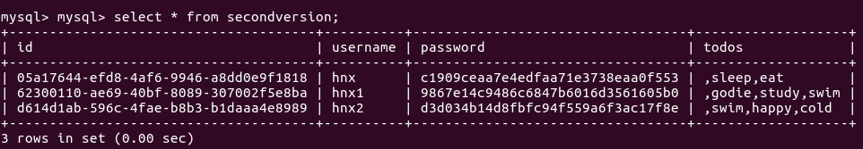

+ 浏览器上显示的页面除了static外其他都使用了http/template模板

+ 程序运行过程中服务器的输出截图
  
  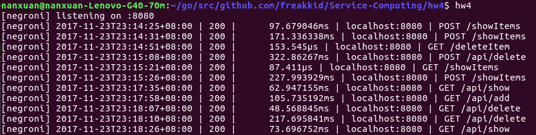

### At last, thanks for reviewing my code!


----------------------------

### 11月24日补充

+ 本次作业的代码结构如下：

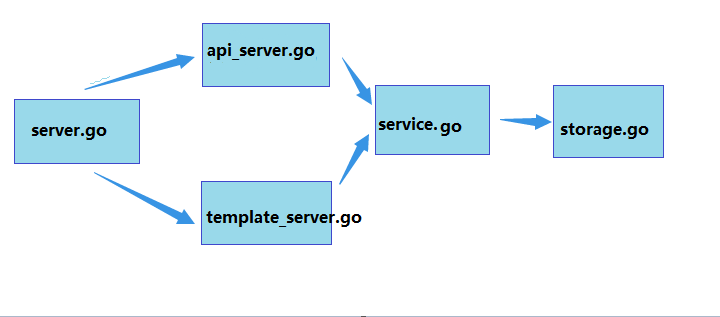

上一层调用下一层，不越级:

main.go调用server.go提供的接口

server负责初始化路由

api\_server处理api访问的handle函数，template\_server处理浏览器html页面访问的handle函数

service负责对客户端发送过来的请求参数进行逻辑处理

storage负责根据service处理的结果对数据库进行操作

server_data存储程序需要用的变量和一些初始化操作如创建数据库和表格

+ 还有写的一篇博客[浅析negroni-gzip 过滤器的源码](http://blog.csdn.net/weixin_40149887/article/details/78627741)

