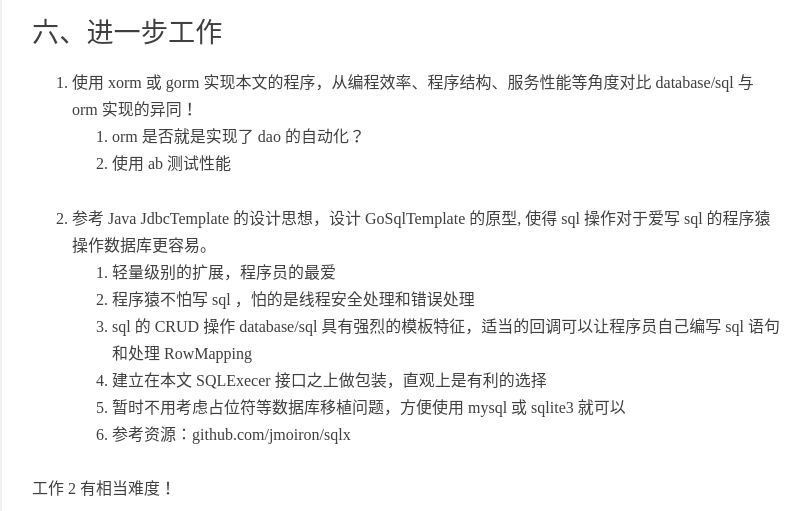
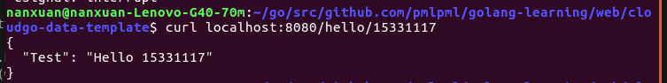
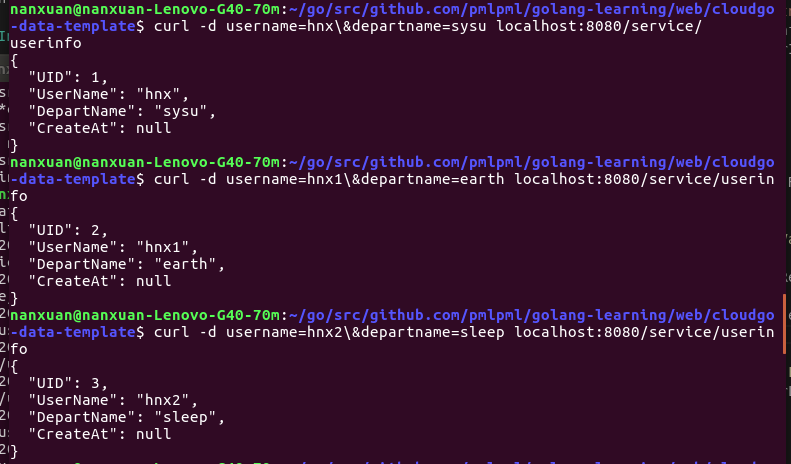
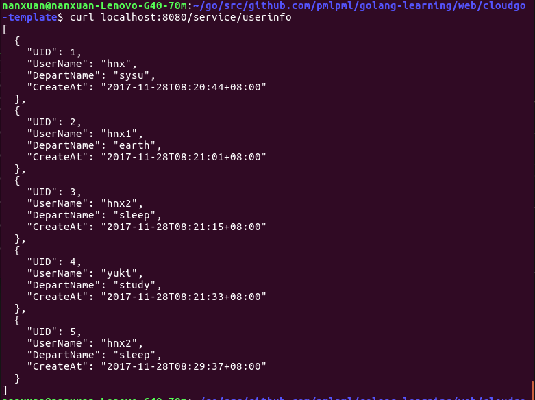
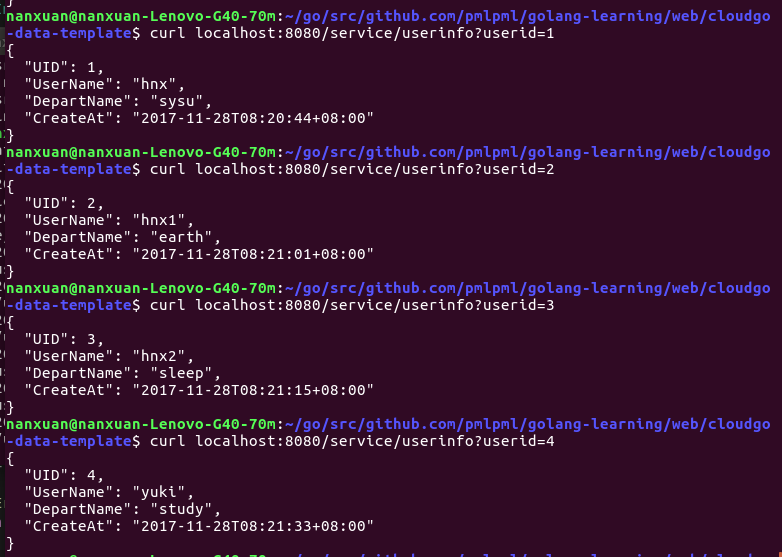
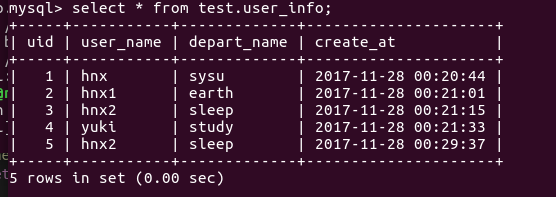
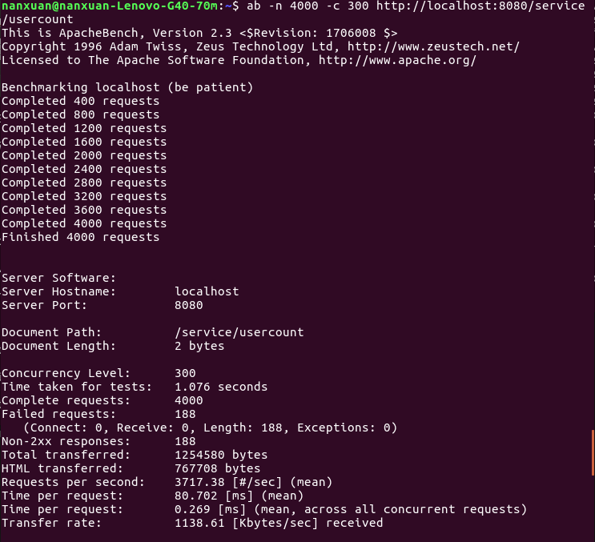
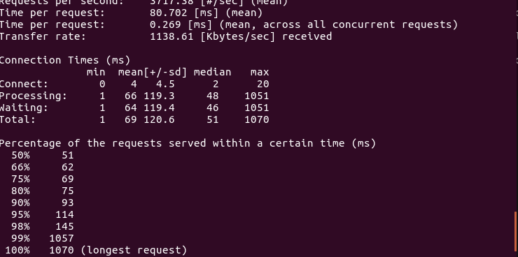
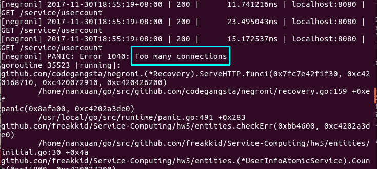

# golang 构建数据服务

+ 作业要求

    

    [作业来源](http://blog.csdn.net/pmlpml/article/details/78602290#六进一步工作)

    由于时间关系目前只完成工作一

+ 关于代码

    * 本次作业代码是使用[xorm](https://github.com/go-xorm/xorm)实现[cloudgo-data](https://github.com/pmlpml/golang-learning/tree/master/web/cloudgo-data)程序

    * Install
        > $ go get github.com/freakkid/Service-Computing/hw5

        由于使用了mysql数据库，因此仍需要更换[代码](https://github.com/freakkid/Service-Computing/blob/master/hw5/entities/initial.go#L37-L38)中mysql用户名和地址并重新编译：

        > $ go install github.com/freakkid/Service-Computing/hw5
    
    * Run
        > $ hw5

+ 代码测试

    * 用curl进行GET测试

        

    * POST添加user
        
        

    * 查看user信息
        
        所有user

        

        根据ID查看user

        

        查看mysql数据库对应的user信息是否一致

        
    
    * 获得user数量信息
    
        

    * 使用 ab 测试性能
        
        从-n 1000,-c 100逐渐增加进行测试，直到请求总数量达到4000时，测试用时明显变长，每次请求的数量为300时，程序开始由于“连接太多”而报错

        
        

        报错：Too many connections

        

+ 从编程效率、程序结构、服务性能等角度对比 database/sql 与 orm 实现的异同。orm 是否就是实现了 dao 的自动化？

    在[hw3](https://github.com/freakkid/Service-Computing/tree/master/hw3)和[hw4](https://github.com/freakkid/Service-Computing/tree/master/hw4)的两次作业中也使用了数据库mysql，依靠golang的database/sql进行编程。在hw3的代码中数据库与server和service层的界限不清晰，有server层的代码混入service层，service层的代码混入数据库处理层，逻辑不清晰，对代码的维护不利；在hw4中花了时间思考和实现代码重构，server和service层和底层的数据库层界限比较分明。
    
    和这次使用了xorm代码的作业进行比较，xorm更贴近平时的编程方式，隐藏了数据访问细节，省去了撰写mysql语句的工作，减小了语句出错的可能性，代码量更少，代码简洁清晰，大大提高了编程效率。

    **orm实现了dao的自动化**，由于实现了自动化，映射和关联管理牺牲了服务性能。

    在程序结构上，更容易实现“entity-dao-service” 层次结构模型，entity是对数据表的对象化。将对象映射数据库表；dao是利用xorm引擎对数据库进行直接的CRUD操作；service是提供业务逻辑，调用dao类方法对数据库进行访问和持久化。结构清晰分明。在hw4的作业代码只分开“对数据库直接操作”storage层和“逻辑判断”的service层，但是没有把数据库对象化做为一层，结构相对而言不够清晰。

+ PS

    本次作业是在[xorm](https://github.com/go-xorm/xorm)的基础上进行更改的xorm更改的，除了使用了xorm处理数据库事务，还对原来代码进行优化，可以检查运行主机上是否已存在数据库和表，没有则自行创建，不会报错，做一些简化工作如去掉不必要的变量，增强鲁棒性。 

    Learning knowledge about a new structure 'entity-dao-service' that I never known before this homeork makes me have a lot of fun. 

+ At Last

    Thanks for reviewing!
