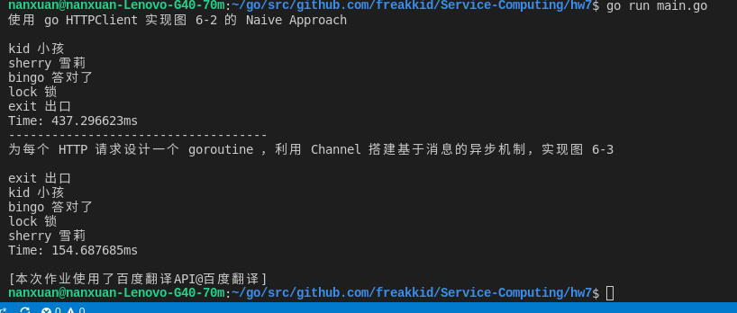

# [goroutine](http://blog.csdn.net/pmlpml/article/details/78850661)

1. 依据文档图6-1，用中文描述 Reactive 动机

    个人理解：Motivation for Reactive Client即是一个异步数据流，相比于同步请求需要一个一个顺序返回请求，reactive编程提供了用异步的方式达到可以同时处理多个来自客户端请求，从而缩短响应时间。另外为了不把内部服务暴露给外界，客户端对内部服务的多个请求的回应将被合并成单个响应再返回给客户端。

2. 使用 go HTTPClient 实现图 6-2 的 Naive Approach

3. 为每个 HTTP 请求设计一个 goroutine ，利用 Channel 搭建基于消息的异步机制，实现图 6-3

    题目2和3代码运行：
    
    > go get github.com/freakkid/Service-Computing/hw7

    > hw7

    运行结果：
    

    关于代码：
    
    * 使用百度翻译的api，设计了5个单词的英译汉请求

4. 对比两种实现，用数据说明 go 异步 REST 服务协作的优势

    可以从上面运行结果的截图看来，如果是一个一个请求的处理需要437.296623ms,使用异步处理则只需154.687685ms，多次运行，均是异步处理用时明显更短。从而可知至少在效率方面，go 异步 REST 服务协作能缩短用户等待时间。

5. 思考： 是否存在一般性的解决方案？

* At last, thanks for reviewing!